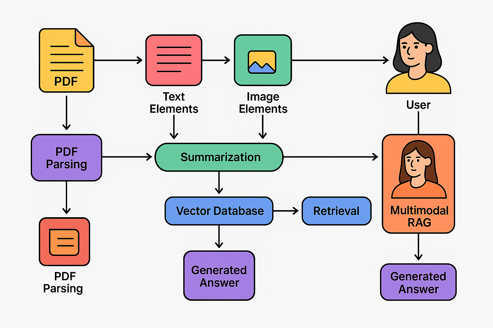

# 🧠 Multimodal RAG: Chat with Your PDFs (Text + Images!)

This project demonstrates a powerful **Multimodal Retrieval-Augmented Generation (RAG)** system. Unlike traditional RAG pipelines that only understand text, this solution can parse, understand, and reason about **both text and images** within a PDF document.

Ask a question about a document, and the system will provide a detailed answer synthesized from the relevant text and will also show you the images that support its answer.

| User Question | AI Response & Retrieved Image |
| :--- | :--- |
| "What did the monkey do when he saw a crocodile?" | **Result:** "One day, a monkey was sitting on a tree by the river when he saw a crocodile swimming towards him. The monkey, being clever, offered the crocodile some sweet fruits from the tree to befriend him." <br><br>  |

*(This is a demonstrative image. The actual output will display images from your PDF.)*

---

## ✨ Core Concepts

### What is RAG?
**Retrieval-Augmented Generation (RAG)** is a technique for building LLM-powered applications that can answer questions about private or specific documents. It works in two stages:
1.  **Retrieval:** First, it searches a knowledge base (like your PDF) to find the most relevant snippets of information related to a user's question.
2.  **Generation:** Then, it feeds this retrieved context to a Large Language Model (LLM) along with the original question, asking it to generate a comprehensive answer.

### Why Multimodal? 🖼️
Traditional RAG is text-only. It would completely ignore the rich information contained in diagrams, charts, and photographs within a document. **Multimodal RAG** solves this by creating a system that can see and understand these visual elements, leading to far more accurate and contextually aware answers.

---

## 🛠️ Technical Workflow & Architecture

This project uses a sophisticated pipeline to process and query multimodal documents. The key to this process is the **`unstructured`** library, which intelligently parses the PDF, and a **Multi-Vector Retrieval** strategy for efficient searching.



### Step 1: Intelligent Document Parsing with `unstructured`

The first and most critical step is to break down the complex structure of a PDF into its constituent parts. We use the powerful `unstructured` library for this, as it can accurately differentiate between text, tables, and images.

The magic happens in this function call:
```python
from unstructured.partition.pdf import partition_pdf

raw_pdf_elements = partition_pdf(
    filename="C:\Multimodal RAG\Data\Monkey.pdf",
    strategy='hi_res',  # Use a high-resolution strategy for accurate layout detection
    extract_images_in_pdf=True,  # The key command to extract images
    extract_image_block_types=["Image"], # Specify that we want image elements
    infer_table_structure=True,  # Recognize table structures
    chunking_strategy="by_title",  # Group text under relevant titles to keep context
    extract_image_block_output_dir="Monkey_extract", # Where to save the extracted image files
)
```
The `partition_pdf` function from `unstructured` analyzes the document and returns a list of elements. Thanks to the `hi_res` strategy and `extract_images_in_pdf=True`, it doesn't just see a wall of text; it identifies and separates:
-   **Text Blocks (`CompositeElement`):** Paragraphs, titles, and other text content.
-   **Image Blocks (`Image`):** It physically extracts image files and saves them to the specified directory.

### Step 2: Element Summarization (Creating Representations)

A vector store search works best on concise, descriptive content. Instead of embedding full, raw text chunks or images, we generate high-quality summaries of each element first. This creates better representations for our retrieval system.

*   **Text Summaries:** A standard LLM (`llama3.1`) is used to create a concise summary of each text chunk.
    ```python
    def summarize_text(text_element):
        prompt = f"Summarize the following text:\n\n{text_element}"
        return llm.invoke([HumanMessage(content=prompt)])
    ```
*   **Image Summaries:** A multimodal, vision-capable LLM (`llava`) is prompted to "describe the contents" of each image. The image data is passed as a `base64` encoded string. This turns visual information into a descriptive text summary.
    ```python
    def summarize_image(encoded_image):
        prompt = [
            HumanMessage(content=[
                {"type": "text", "text": "Describe the contents of this image."},
                {"type": "image_url", "image_url": {"url": f"data:image/jpeg;base64,{encoded_image}"}},
            ])
        ]
        return llm_vision.invoke(prompt)
    ```

### Step 3: The Multi-Vector Retriever Strategy

This is an advanced RAG technique for handling complex data. Instead of trying to stuff raw images and long text into a single vector store, we separate the concerns:

1.  **Vector Store (FAISS):** The *summaries* (both text and image summaries) are embedded using `OllamaEmbeddings` and stored in a FAISS vector store. This store is optimized for fast, semantic searching.
2.  **Document Store:** The *original, full content* (the raw text chunks and the base64-encoded images) is stored separately, linked to the summaries by a unique ID.

This way, the retriever searches over the small, efficient summaries. Once it finds the most relevant ones, it uses their IDs to fetch the full, original content to pass to the final LLM.

```python
# The vectorstore contains summaries, but the metadata links to the original content
doc = Document(
    page_content=summary,
    metadata={
        'id': unique_id,
        'type': 'image', # or 'text'
        'original_content': full_base64_image # or original_text_chunk
    }
)
vectorstore = FAISS.from_documents(documents=documents, embedding=embedding)
```

### Step 4: Retrieval and Generation (Answering the Question)

When a user asks a question, the final pipeline executes:
1.  **Search:** The system performs a similarity search in the FAISS vector store to find the most relevant *summaries*.
2.  **Retrieve Full Content:** It retrieves the original, full-quality text and images linked to these summaries.
3.  **Construct Context:** It dynamically builds a rich context string containing both the text snippets and the image descriptions. It also gathers the actual image data.
4.  **Generate Answer:** This rich context is passed to the final LLM (`llama3.1`) along with the user's question. The LLM then generates a comprehensive answer based on all the provided information.
5.  **Display Results:** The final text answer is printed, and the relevant images retrieved during the process are displayed.

```python
def answer(question):
    # Search the vector store of summaries
    relevant_docs = db.similarity_search(question)
    context = ""
    relevant_images = []

    # Retrieve original content using metadata
    for d in relevant_docs:
        if d.metadata['type'] == 'text':
            context += '[text]' + d.metadata['original_content']
        elif d.metadata['type'] == 'image':
            context += '[image]' + d.page_content # Use the summary in the context
            relevant_images.append(d.metadata['original_content'])

    # Run the final generation chain
    result = qa_chain.run({'context': context, 'question': question})
    return result, relevant_images
```

---

## 🚀 How to Run This Project

### 1. Prerequisites
*   Python 3.8+
*   A running instance of **Ollama** on your local machine.
*   The required Ollama models pulled:
    ```bash
    ollama pull llama3.1
    ollama pull llava
    ollama pull nomic-embed-text
    ```

### 2. Installation
Clone this repository and install the necessary Python packages:
```bash
git clone https://github.com/your-username/multimodal-rag.git
cd multimodal-rag
pip install langchain unstructured[all-docs] pydantic lxml tiktoken langchain-community langchain-core sentence-transformers faiss-cpu
```

### 3. Usage
1.  **Add Your PDF:** Place the PDF file you want to process into the `Data/` directory.
2.  **Update the Filename:** In the script, update the `filename` variable in the `partition_pdf` call to point to your PDF file.
3.  **Run the Script:** Execute the Python script. The first run will process the PDF, create the summaries, and save the FAISS vector store locally in a folder named `faiss_index_pdf`.
4.  **Ask Questions:** Use the `answer()` function at the end of the script to ask questions about your document.
    ```python
    result, relevant_images = answer("How does the friendship between the monkey and the crocodile begin?")
    print(result)

    # This part will display the retrieved images in a Jupyter environment
    for encoded_image in relevant_images:
        display(Image(base64.b64decode(encoded_image)))
    ```
